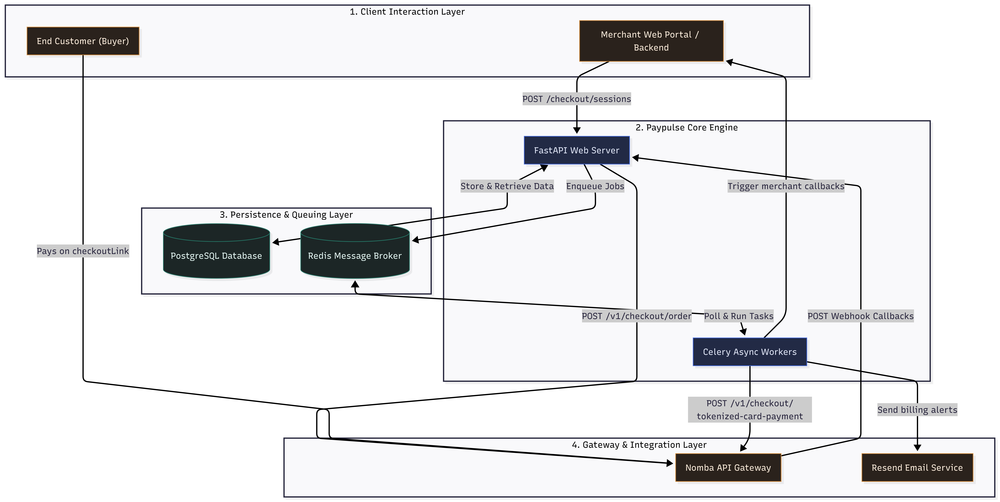
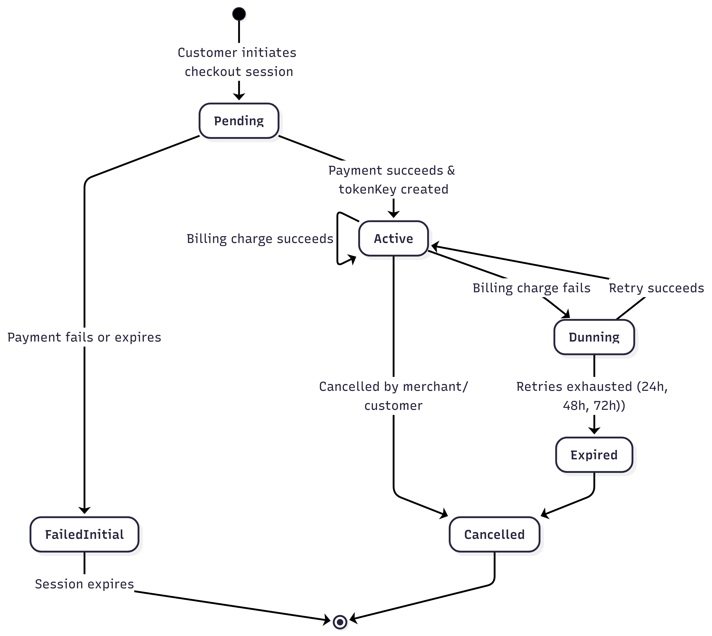
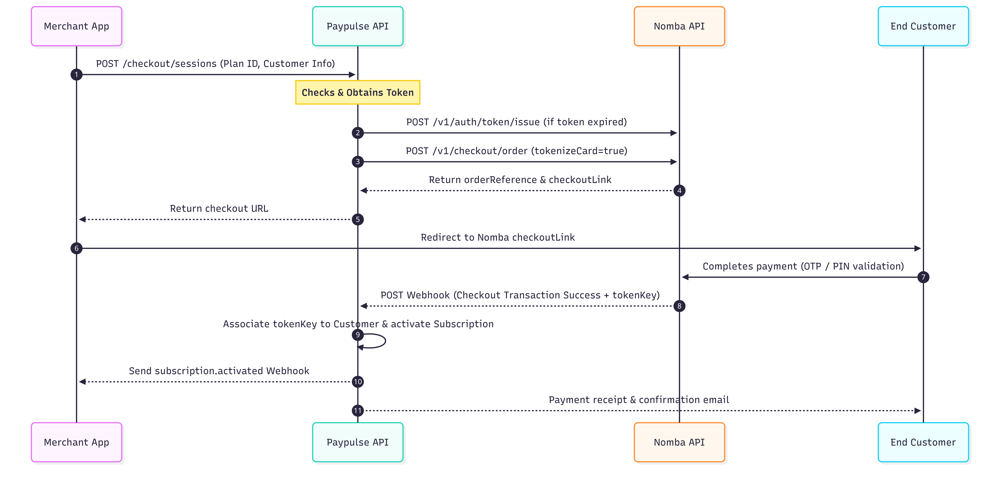
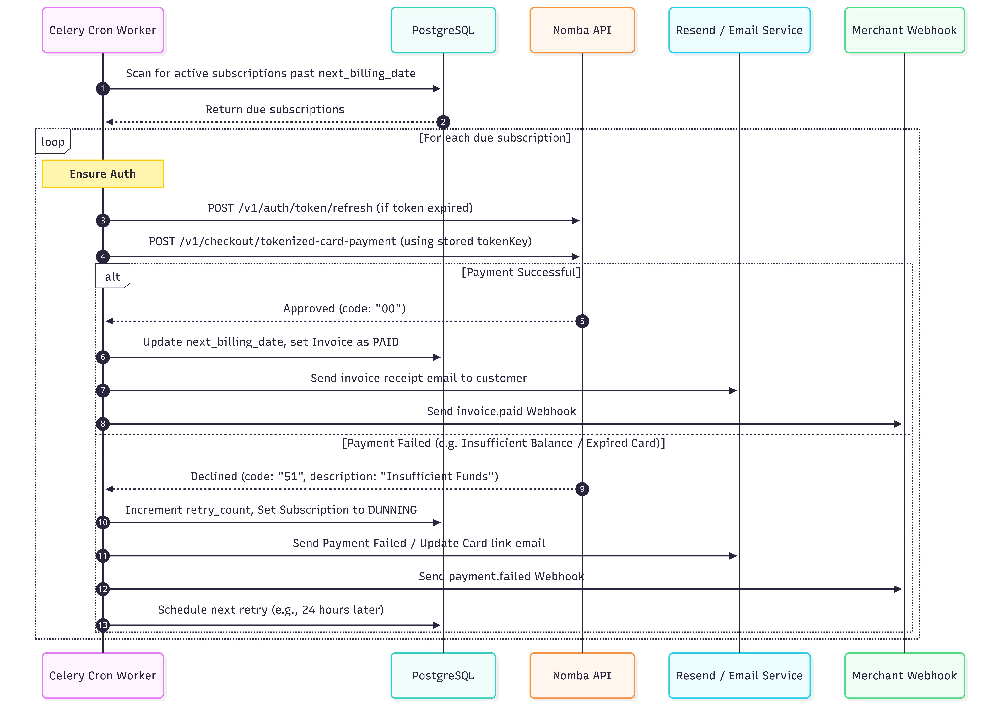

# Architecture & Flow Diagrams

This directory contains visual representations of Paypulse's architecture, subscription lifecycle, and core transactional workflows built on top of the Nomba API.

---

## Diagrams List

### 1. [System Architecture](system_architecture.png)
Provides a high-level modular view of how the client layers, FastAPI web server, Celery worker pool, PostgreSQL/Redis databases, and Nomba API integrate.

---

### 2. [Subscription Lifecycle State Machine](subscription_lifecycle.png)
Illustrates subscription state transitions from creation (`Pending`/`AwaitingPayment`), to execution (`Active`), and through failure recovery (`Dunning` retries) to finalization (`Expired`/`Cancelled`).

---

### 3. [Checkout & Tokenization Flow](checkout_flow.png)
Sequence diagram outlining the initial checkout initialization, redirection to Nomba, token generation, webhook collection, and subscription activation.

---

### 4. [Recurring Billing & Dunning Cycle](recurring_billing_flow.png)
Sequence diagram illustrating background worker tasks scanning due bills, charging saved tokens, handling success actions, and triggering retry intervals on failures.

